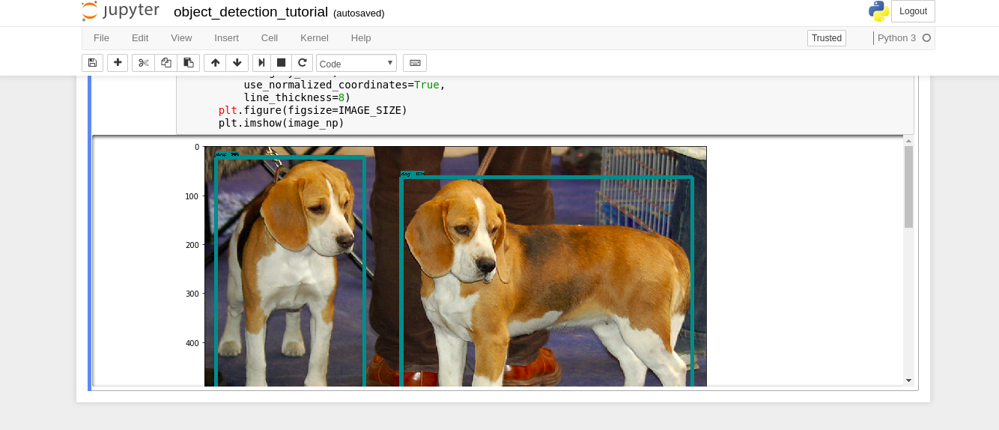

# tensorflow-api
Docker container with tensorflow/tensorflow:nightly-gpu-py3 and various 
<a href="https://github.com/tensorflow/models">models</a>.<br/>
Dependencies: <a href="https://www.docker.com/">Docker</a>,
<a href="https://www.tensorflow.org/install/install_linux">
NVIDIA requirements to run TensorFlow with GPU support</a><br/>
Default mode: <a href="http://jupyter.org/index.html">Jupyter Notebook</a>
## Building the container
To build the container, change directory to
<a href="https://github.com/ninjrok/tensorflow-api">tensorflow-api</a> and run the following command.
```
docker build -t tensorflow-api .
```
## Running the container
```
docker run -p 6006:6006 tensorflow-api
```
Optional environment variable: PORT. This will run jupyter notebook on port 8998.
```
docker run -p 8998:8998 -e PORT=8998 tensorflow-api
```
## Verify your installation
Try running the notebook at 
<a href="http://localhost:6006/notebooks/models/research/object_detection/object_detection_tutorial.ipynb">
models/research/object_detection/object_detection_tutorial.ipynb</a>.<br/>
You should see the following output.<br/>
